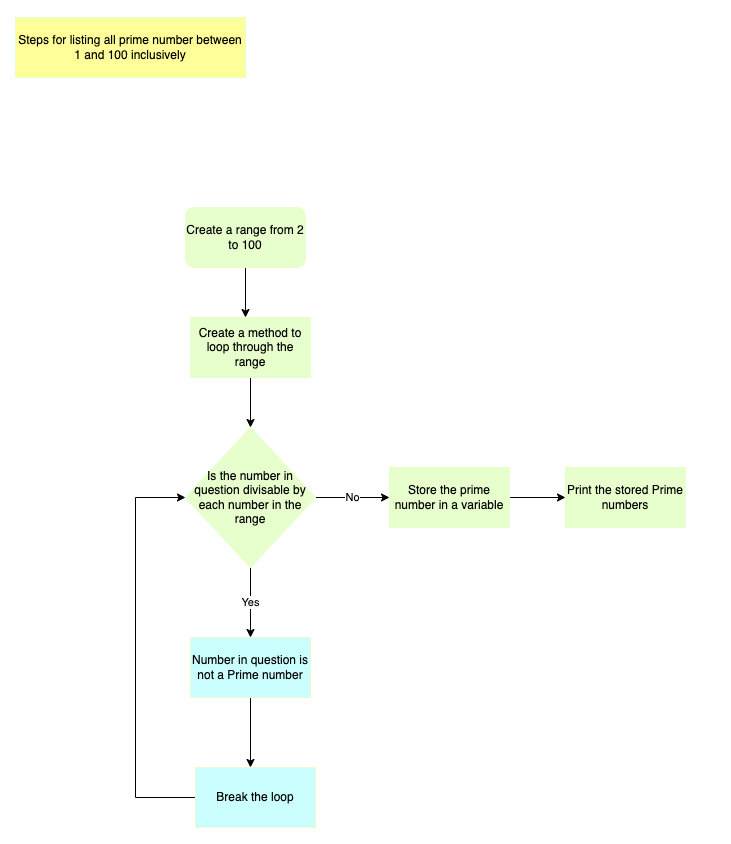

# Nhi Tran T1A1 Workbook


### Q1. Identify and explain common and important components and concepts of web development markup languages.

Web development markup are languages used to format the basic skeleton of a website and the text it contains.  Without markup language rules to control the order of how the website is displayed with its content, links and layout; it would be a block of text with no structure and hard to digest. Web development markup language is needed to “distinguish between the text itself and the instruction for a text” (ThoughtCo 2021).

All markup languages are included within programming code and read by the browser  to present information.  It uses tags to comment and give instructions. The most commonly used markup language in Web Development is HMTL and XML.

Hypertext Markup Language (HTML) is mainly used for website user interface as its main function is to tell the browser where and how to display its content.  It uses tags and attributes that has predefine document structure to create the layout.  Semantic tags is used to define the layout of the website. HTML has tags to display elements such as image, link, headings, list and paragraph.  It also has attribute tags such as alt and blank that influence the website behaviour.

XML stands for Extensible Markup Language.  The main function of XML is used to store and move data across applications. Unlike HTML it does not influence how the website is presented.  Alone the XML file does not do anything, so it needs another technology to work. Jarrod said "XML have no predefine structure". It uses opening, closing and child tag that are structure by the user. The user can also add or remove the tags.  This is why it is a extensible language (Kinsta 2022).


### Q2. Define the features of the following technologies that are essential in terms of the development of the internet:
- packets
 - IP addresses (IPv4 and IPv6) 
 - routers and routing
 - domains and DNS 

 Explain how each technology has contributed to the development of the internet.

Before starting this course, I had no idea how and what was required to make the internet work.  I now know why we need the following features and how important they were in terms of the development of the internet. 

For us to be able to send anything from one computer to another it uses computer networks to facilitate the communication and exchange of data. Data sent via the network is broken down in smaller parts called packets.  Each packet includes data called payload and packet headers that stores information about the data, where it’s from, its' destination and instructions on how to reconstruct the original message (Britannica, 2021).  Packet switching perform the function of grouping data into packets and are transmitted over the digital network. 

As more and more people started using the internet, it got busier and more congested. For larger messages or files to be sent across the network, it traditionally took up one line and stopped other computers from sending or receiving messages. To solve this issue the feature of packets was developed.  The use of packages to break down large files into smaller parts meant that it could be sent across the network at different times or routes.  This was essential to the development of the internet as it made it more reliable and no longer caused congestion to the network (Computer Networks: Crash Course Computer Science #28, 2017).

The destination of each packet is called an Internet Protocol (IP) address.  An IP address is a unique number that identifies a computer.  It's like a digital postal address for computers and networking devices.  Without it computers don't know where to send messages and can't communication to each other.  IPv4 addresses is what we use today but could soon run out.  This could cause issues for Internet users and the growth of the internet.  As a result, IPv6 was developed allowing the internet to be scalable (ItProPortal, 2013).

IP addresses are assigned by routers.  As a message is sent through internet it may require multiple stops.  At each stop the router will check the message's destination IP address and works out which is the best route to send the message next. This continues until the message reaches its destination. This process is called routing and makes it possible that packets from the same message end up taking different routes but end up at the same computer. 

The domain name is a human-friendly address for a website that is easier to read and type in. When we type in a URL into our browser the Domain Name Systems (DNS) helps to translate domain names into an IP address that computers recognise. The DNS also manages multiple users accessing the domain name at the same time by assigning the user to a server closer to them.  The development of DNS has meant that the internet has quicker and more reliable responses (Wikipedia, March 2022).


### Q3. Define the features of the following technologies that are essential in terms of the development of the internet:
 - TCP
 - HTTP and HTTPS
 - web browsers (requests, rendering and developer tools)

Explain how each technology has contributed to the development of client and server communication over the internet (50 - 150 words for each technology)

Transition Control Protocol(TCP) is a set of rules called a protocol that manages whose turn it is to send data, what kind of data is being sent, and how this data is transformed.  While TCP and IP work together to facilitate this function they are two seperate set of rules.  While the IP "handles the delivery of the data, TCP keeps track of segments" (Wikipedia, April 2022). 

TCP organises each packet and helps the destination computer reassumble the packets into the origanal message. For this reason TCP is essential to the development of the internet.  TCP makes the internet more realiable at times of network congestion or problems by rearranging data that are out of order back into its origanal state. It sits on the Transport layer in the layered server architecture system (Guru99, March 2022). It helps to moinitor the succesful data transmission and control flow of data being sent at what time. If an error is detected when each segment is tansmitted, the TCP also helps to resolve this so it reaches its destination.

Hyper Transfer Protocol (HTTP) is the data transfer protocol used on the World Wide Web (WWW). Like IP, HTTP sit on the applicaton layer of the server architetture system.  WWW is the communication between web clients (a browser) and web servers (w3schools, viewed April 2022).  When we search for something on our browser it sends off a HTTP request and waits for the server to respond back. The server sends back to the browser a response to advise if the connection is successful which in the 200's range.  Unsuccessful responses range between 300 to 500's depending on the issue.

Hypertext Transfer Protocol Secure (HTTPS) is a secure version of HTTP. It is secure as the data transferred is encrypted and to gain access login credetials is needed using the Secure Sockets Layer (SSL) protocol. The security provided by HTTPS sites has been essential to the continue growth of the internet and its users.  The public security concerns are growing and when they visit a website they want to know it is a site they can trust (GlocalSign May 2018). 

Web browsers is a software program. When the browser sends a http request and a successful response is received, this then allows the browser to retrieve and display the information in different media forms "connected via hyperlinks and categorirised with help of URLs" (javaTPoint, viewed 12 April 2022).  To display the information retrieved from the server it also needs to translate that data by using a rendering process. This data in the form of HTML.


### Q4. Identify THREE data structures used in the Ruby programming language and explain the reasons for using each.

Three data structures used in Ruby programming language are Scalars, Arrays and Maps.  

Scalars holds a single value.  It is used to store a value that can be accessed easily.  Two categories of scalars are numbers or strings. 

An Array is a collection of similar values and used to store a specific ordered list of scalars. It is accessed by the location of the value called an array index.  The first value of the array gets an index of zero.  Every other value in the list is based on its distance from the first value.  

Maps are a list of key-value pairs where the keys map to one value or scalar.  "The key is the index pointing to the value" (Medium, Apr 2017).  Maps is used when the key and its associated value are different data types.  For example, a key can be a string ("age") and value can be an integer is "20".  Unlike arrays you do not need to access values via the index, and it does not need to be ordered.  An analogy commonly used for a map is a dictionary. We can use it to look up a value using the key.  There are many types of sub maps. Hashes is an example of sub map.


### Q5. Describe the features of interpreters and compilers and how they are different.

Computer programs turn high value language (source code) understood by humans into machine code understood by computers.  Both interpreters and compilers can be used for this task, but they work differently.  An Interpreter translates and executes the source code one line at a time.  Though it can be slower to to execute then compilers, error are displayed each time one line is run, hence giving quicker feedback.  Syntax errors are picked up when the program is run.  Programs such as Ruby, JavaScript and Python are examples of interpreted language.

Compilers translate an entire program into machine code all in one go. When there is a mistake in the program and it doesn't meet the syntax rule of that program, it needs to be fixed or it will fail to compile.  Programs such as C and Java use compilers (Guru 99, 2022). 
 

### Q6. Identify TWO commonly used programming languages and explain the benefits and drawbacks of each.

One programming language that is commonly used is Python.  It is a high-level program language that is easier to read, understand and use.  It is freely distributed and the Python community encourages people to contribute code, documents and resources making it easier to maintain and enhance (Infoworld, February 2015). Jarrod said that Python is "consistent because it uses indentation, and the code needs to be formatted correctly.  As it is a interpreted language, drawbacks is that it is slower to execute and if not thoroughly tested at run time it can introduce errors into Production environment. 

JavaScript is another popular programming language.  The has a large ecosystem of supporter and most of the famous companies such as Google and Amazon use JavaScript.  It is easy to use JavaScript alongside other programming languages.  It allows for extensions to help developers code more efficiently.  Unlike Python it is used on both front and backend development making it more versatile. Jarrod said JavaScript's "biggest disadvantages is it was hacked together in 10 days". As JavaScript code can be viewed by the user, there can be room for the security to be compromised for malicious purposes.  Different browsers can also interpret JavaScript differently especially with some new functions. Due to this it can be more time consuming as the code needs to be run across different browsers.  


### Q7. Identify TWO ethical issues from the areas below and discuss the extent to which an IT professional is ethically responsible in terms of the issue.

List of topics containing ethical issues:
 - access to a user’s personal information (medical, family, financial, personal attributes such as sexuality, religion, or beliefs)
 - intellectual property, copyright, and acknowledgement.
 - criminal acts such as theft, fraud, trafficking and distribution of prohibited substances, terrorism
 - GPS tracking data and other types of metadata, MAC addresses, hardware fingerprints
 - freedom of thought, conscience, speech and the media
 - aggressive sales and marketing practices designed to mislead and deceive consumers
 - trading of shares on the stock exchange OR crypto-currencies

For each ethical issue identify a source of legal information relating to the ethical issue and discuss whether the law is helpful in assisting a developer to act in an ethical way. (Word count guide: 200 words max)

Safeguarding and ensuring customer personal privacy is an important aspect in information technology.   Personal information is being collected about us all the time as we go about our daily live.  Sometimes we give our consent and sometimes we don't realise that our personal information is being collected such as when we search the web. IT Professional are increasingly questioning ethical standards on how their companies are acting on ethical grounds. Examples are companies such as Facebook, Google and Amazon that have had their employees raising their concerns publicly (Triple Pundit Sept. 2020).  Social media and mobile phone services providers are collecting details on our locations, communication behaviour and patterns and selling it or sharing it without informing their customers.  

In Australia the Privacy Act 1988 (Privacy Act) require government agencies and most private sector organisation to adhere to 13 Australian Privacy Principles (APPs) when dealing with personal information.  This information can be found in the Australian Government office of Australian Information Commissioner (OAIC) website (OAIC July 2019).  It encourages organisations to be open and transparent about Personal Information they collect and how it will be handled.  It ensures personal and sensitive information is secure and used only for the purpose it was intended.  

To reduce the risk of mistakes made that would breach someones private information, there are rules or preventative workplaces guidelines. Some industries such as banking and finance are highly regulated and their responsibilities to protect their customers personal information is clearer.  Companies need to provide their employees with training about these guidelines every year to ensure that their employees are fully aware of their obligations to their customers. Ongoing training can arm the developer with information on what security consideration when working with websites, products or specific function or features.  Such as taking measures to protect their website from providing any mean of anyone to hack in from the UI or the backend.  The Privacy Act also covers which parties are responsible for ensuring the privacy of their customers.  This can help to illuminate any confusion by the developer if they are also responsible to uphold the rules and have support if they are unsure of their obligations as developers or employees.

Criminal acts such as theft and fraud are another pressing concern as the reliance of technology is growing significantly especially the last two years with the COVID Pandemic.  Increase dependence of the internet has also seen the rise of cyber-crimes.  According to the Australian Federal Police (AFP) website Cybercrime involves online criminals targeting computers and other information communication technologies (ICTs) purposely committing theft of personal information, economical loss, or fraud (AFP viewed April 2022). The Criminal code Act 1995 in the Commonwealth legislation covers computer vulnerabilities with access or destruction of data, creating and distribution of malicious software. It provides the Australian Cyber Security Centre as a point of call for IT professionals to get help if they believe they have detected any such sign with work.  At the same time improving a company’s website can also help foster trust with their users. 


### Q8. Explain control flow, using examples from the Ruby programming language

Control flow is a way to tell a program what to do when a specific condition is meet. All control flow statement results are true or false vales and depending on the results different functions are executed (Open Genus IQ, ).  In Ruby conditional statements allow the program to be selective on what part the program to execute.  There are different types of control flow statements that can be used depending on how the statements are written and how many conditions there are. 

Decision making statements such as if-else and elsif is useful for simple control flows.  Conditions are evaluated to see if it is meet for not.  If the condition is meet, the function inside is executed. The daily condition of if you are hungry or not hungry is an example of a control flow that requires some decision making.  If you are hungry then it's time to eat, else wait for another hour. Refer to the code below: 

```
if hungry
    puts "time to eat"
else 
    puts "wait for another hour"
end    
```

Short circuit logic statement can be used when you want to combine two or more conditions.  Using the same example above a short circuit logic statement looks like this:
```
hungry = true
starving = true

if hungry && starving
    puts "don't cook just grab maccas"
else
    puts "see what you can cook"
end
``` 

Case statments can be alternatively to if-elsif-else statement.
```Case statement
case hungry
when "starving"
    puts "You are #{starving}, quickly eat"
when "famished"
    puts "Just grab anything a can of tuna"
when "not_hungry"
    puts "Wait another hour"
else
    puts "Grab some water"
end
```       

### Q9. Explain type coercion.
Type coercion is the changing of data from one type to another.  In Ruby type coercion can be done explicitly by using methods like .to_s to change a integer into a string.  Other methods are to_i, to_int, and .to_f.

Ruby also use a method called implicit coercion. Implicit coercion is used when a certain type is strictly needed or will raise an error (AppSignal, Sept. 2018)

### Q10. Explain data types, using examples
Data used in computer programs are classified into types.  Most common data types used in Ruby are the following:

Numbers - there are two data types in numbers.  Integer that are whole numbers like 20 and Float that has decimals like 20.88.

Strings - Sequence of characters that are words for a sentence.  A string is surrounded by quotes like
```"This is a string"```

Booleans - where the data value is true or false.  

Arrays - An Array stores a specific ordered list.  The values stored in an array can be any type of data. For example: 
```array = ["nhi", 20, "float", "string"]```

Hashes - Is a list of key-value pairs where a value is assigned to a key(plant name), using the => sign and value (price). An example of this is: 
```plant_price = {"Cactus" => 20, "Fern" = > 10, "Ivy" => 15}```

Synmbols - Are used instead of strings for the purposes of saving memory space.  Symbols are created by using colon(:) syntax.  An example of a symbols is:
```indoor_plants = {:md => "Monstera Delciosa", :fl => "Fiddle Leaf Fig", :sp = "Spider Plant"}```


### Q11. Here’s the problem: “There is a restaurant serving a variety of food. The customers want to be able to buy food of their choice. All the staff just quit, how can you build an app to replace them?”
 - Identify the classes you would use to solve the problem
 - Write a short explanation of why you would use the classes you have identified

 The following classes would be required to solve the problem of no staff and the running of a restaurant service:

* Greeting - Needed to great customers and ask them if they want to take away or eat in.  If eating in a menu will be provided to the customer.
* Orders - This class will be required to ask the customer what they would like to order, record the option of eat in or take away and provide the variety of food the restaurant is serving.  It also includes taking orders option if available.  For example, what size, what sauce to go with it of if they would like a drink.
* Cooking - Will be responsible for taking the order and cooking the food
* Service - Will be responsible for picking up the order and packing it in a bag and providing napkins, cutlery or sauces and drinks. If the customer is eating in, it would deliver the meal to the customer’s table
* Payment - Would collect payment for the takeaway order or after the customer is finish with their meal.
* Cleanup - Will define what needs to happen after the customer is finish with their meal.  To clear and clean up the table and take them back to the kitchen.


### Q12. Identify and explain the error in the code snippet below that is preventing correct execution of the program.

The first line of the code snippet has 1 error preventing it from executing correctly.
```
celsius = gets
```
When running the line above an error will display advising there is an undefined method for n":String.  What this means is that the value entered by the user (celsius) is an integar but the program is expecting a string. To correct this the type coercion method can be used to convert the input expected for celsius to an integer as follow:
```
celsius = gets.to_i
```

### Q13. The code snippet below looks for the first two elements that are out of order and swaps them; however, it is not producing the correct results. Rewrite the code so that it works correctly.

```
arr = [5, 22, 29, 39, 19, 51, 78, 96, 84]
i = 0

while (i < arr.size - 1 and arr[i] < arr[i + 1])
    i = i + 1 end
puts i 
arr[i], arr[i + 1] = arr[i + 1], arr[i]
puts arr     
```

### Q14. Demonstrate your algorithmic thinking through completing the following two tasks, in order:
 1. Create a flowchart to outline the steps for listing all prime numbers between 1 and 100 (inclusive). Your flowchart should make use of standard conventions for flowcharts to indicate processes, tasks, actions, or operations
 2. Write pseudocode for the process outlined in your flowchart

#### Flow Chart


#### Pseudocode
* Create a variable to store the number range from 2 >= 100
* Create a method to loop through the range
* Ask if the number is divisable by each number in the range
* If one of those numbers has 0 remaining, then the number in question is not a prime.  Break the loop
* If the number is not divisable by any other number in the range then store in an array
* Print the stored Prime numbers once reach the end of the range (100)


### Q15.  Write pseudocode OR Ruby code for the following problem:
You have access to two variables: raining (boolean) and temperature (integer). If it’s raining and the temperature is less than 15 degrees, print to the screen “It’s wet and cold”, if it is less than 15 but not raining print “It’s not raining but cold”. If it’s greater than or equal to 15 but not raining print “It’s warm but not raining”, and otherwise tell them “It’s warm and raining”.

```
raining = false
temp = 15

if raining && temp < 15
  puts "It's wet and cold"
elsif !raining && temp < 15
  puts "It's not raining but cold"
elsif !raining && temp >= 15
  puts "It's warm but not raining"
else
  puts "It's warm and raining"
end
```

### Q16. ACME Corporation are hiring a new junior developer, as part of their hiring criteria they've created a "coding skill score" based on the specific competencies they require for this role; the more important the skill is for ACME corp, the more points it contributes to the "coding skill score" The skills are weighted as follows:
 - Python (1)
 - Ruby (2)
 - Bash (4)
 - Git (8)
 - HTML (16)
 - TDD (32)
 - CSS (64)
 - JavaScript (128)
​
 Write a program that allows a user to input their skills and then tells them 
 a) Their overall "coding skill score" 
 b) Skills they may want to learn, and how much each one would improve their score
```

# Create method to use later.  Method will collect answers and sum up weighting to make up the overall codeing skill score.
# def coding_skill_score (total)
weighting = {
    :Python => 1,
    :Ruby => 2,
    :Bash => 4,
    :Git => 8,
    :HTML => 16, 
    :TDD => 32, 
    :CSS => 64,
    :JavaScript => 128
}

# Ask user if they are competent in any of the coding skills listed in weighting. 
puts "Are you competent in any of the following coding skills?  If yes, please list below.\nPython, Ruby, Bash, Git, Html, TDD, CSS or JavaScript."
#Convert answer to uppercase just in case user inputs lowercae
answer = gets.upcase.chomp()

# Total score starts with 0.  If user inputs skill included in weighting, then store weighting of that skill in the totals variable.
def score
  if answer.includes?("P")
    score << (:Python)
    
  end  
end    

#Need to compare answer with weighting.  If the answer is in weighting then return the value and store in the total array.

# puts answer
  puts score

# while total < weighting.length - 1
  
# If the answer is yes store the weight of the skill from the variables above into total variable.  Total starts at 0.
# total = 0
#     if answer == y
#       total = total + Python
#     elsif answer == n
#       total = 0
#     else 
#       puts "This is not a valid answer"  
#     end
# end

# puts score

# Create method to store the answers and show overall score
# def run_array_questions
#   #create answer variable to store answers
#   answer = ""
#   score = 0
#     # For each question inside the question array
#     for question in questions
#       # Print out prompt for question looping through
#       puts question.prompt
#       # Store answer for each response
#       answer = gets.chomp()
#       # Check if answer and if they answer yes then keep incrementing score
  
# Error handling if user does not enter response expected
# Once user answer all the questions their answer needs to sum up th results to get their overall coding skill score.  Tell the user what their score.
# Print out what skills the user does not have 
# Tell them how much each skill (that they don't have) would improve their score
```

# Reference List

AFP viewed 12 April 2022, Cyber crime, <https://www.afp.gov.au/what-we-do/crime-types/cyber-crime>

AppSignal Sept. 2018, #to_s or #to_str? Explicitly casting vs. implicitly coercing types in Ruby, viewed 4 April 2022, <https://blog.appsignal.com/2018/09/25/explicitly-casting-vs-implicitly-coercing-types-in-ruby.html>

Britannica 2021, A packet of data, viewed 1 April 2022, <https://www.britannica.com/topic/ARPANET/A-packet-of-data>.

Computer Networks: Crash Course Computer Science #28, September 2017, viewed 1 April 2022, <https://www.youtube.com/watch?v=3QhU9jd03a0>.

GlobalSign May 2022, What's the difference between HTTP and HTTPS?, viewed 12 April 2022, <https://www.globalsign.com/en/blog/the-difference-between-http-and-https>.

Guru99 February 2022, Compilers Vs. Interpreters: What's the Difference?, viewed 3 April 2022, <https://www.guru99.com/difference-compiler-vs-interpreter.html>

Guru99 March 2022, TCP/IP Model: What are Layers & Protocol? TCP/IP Stack, viewed 12 April 2022, <https://www.guru99.com/tcp-ip-model.html>.

java T Point viewed 12 April 2022, What is a Browser?, <https://www.javatpoint.com/browsers>.

Infoworld February 2015, A developer's guide to the pros and cons of Python, viewed 3 April 2022, <https://www.infoworld.com/article/2887974/a-developer-s-guide-to-the-pro-s-and-con-s-of-python.html>.

ITProPortal July 2013, IP Addresses: How they shaped the past of the Internet and what they will influence in its future, viewed 2 April 2022, <https://www.itproportal.com/2013/07/02/ip-addresses-how-they-shaped-the-past-of-the-internet-and-what-they-will-influence-its-future/>.

Kinsta April 2022, XML vs HTML: Learn the Difference Between These Markup Languages, viewed 31 March 2022, <https://kinsta.com/blog/xml-vs-html/>.

Medium April 2017,  Ruby 101: Data Structures, viewed 3 April, <https://medium.com/the-renaissance-developer/ruby-101-data-structures-7705d82ec1>.

OAIC July 2019, The Privacy Act, viewed 12 April 2022, <https://www.oaic.gov.au/privacy/the-privacy-act>.

Triple Pudit Sept. 2020, The 5 Most Important Ethical Issues Facing Tech, viewed 12 April 2022, <https://www.triplepundit.com/story/2020/5-ethical-issues-tech/138326>

ThoughtCo March 2021, What are markup languages?, viewed 28 February 2022, <https://www.thoughtco.com/what-are-markup-languages-3468655>.

Wikipedia March 2022, Domain Name System, viewed 3 April 2022, <https://en.wikipedia.org/wiki/Domain_Name_System>.

Wikipedia April 2022, Transmission Control Protocol, viewed 12 April 2022, <https://en.wikipedia.org/wiki/Transmission_Control_Protocol>.

w3schools viewed 12 April 2022, What is HTTP?, <https://www.w3schools.com/whatis/whatis_http.asp>.
