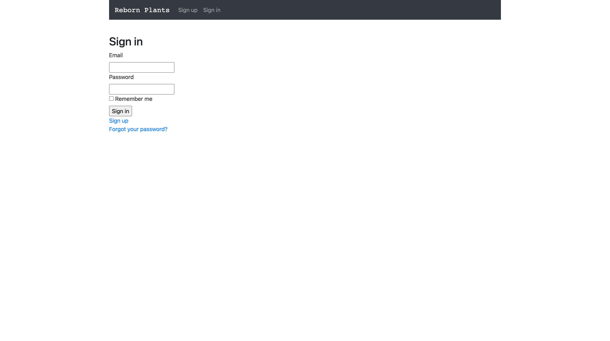
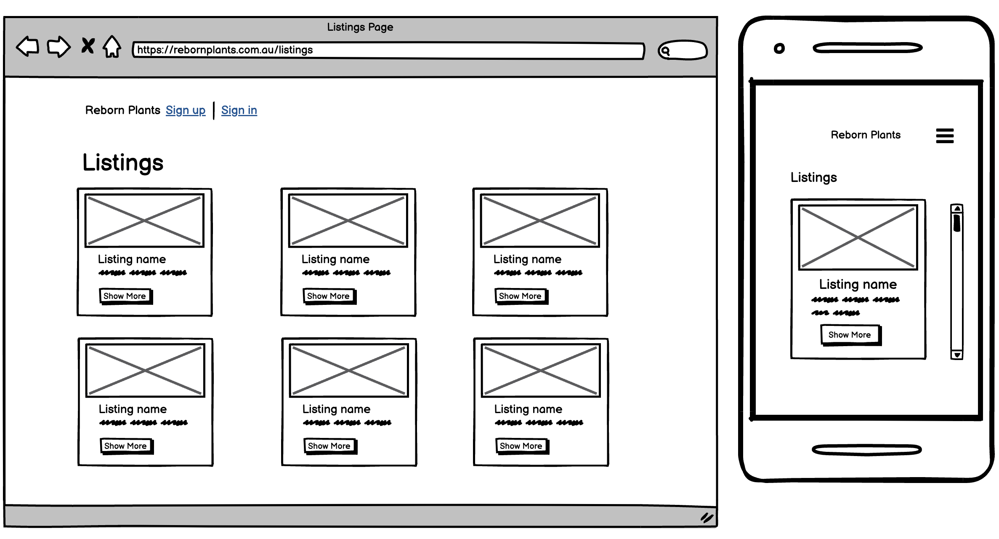

# README - Documentation

[Live website](https://reborn-plants.herokuapp.com/)

[GitHub link](https://github.com/nhithutran/Reborn-Plants.git)

--------------------------------------------------------------------------------------------------

### **Problem I'm trying to solve by building this particular marketplace app and why?**

The pandemic drove many indoor and investing time and money on plants.  Plant lovers continue to collect plants and become horticultural enthusiast.  Others may no longer have time to look after their plant babies or have space for them when moving homes. Reborn plants provide a specialist plant sites to connect plant lovers in Australia and give pre-loved plants a new home. Reborn plants are a one stop shop for new or pre-loved plants and plant related items.  

What do you do with a plant that you no longer want or have time for?  There is another option besides throwing it away.  Trading on pre-loved plants not only saves money compared with the cost of a new plant, but it is also sustainable for the environment.  Users can buy a cheaper well-established plant, get tips to look after the plant from sellers and ensure that it is from good stock that will survive.  It's less stressful for plant sellers when they know that their plant is going to a good home.  Instead of trolling through Facebook Marketplace, Gumtree or eBay, Reborn plants provide an easy and simple website to buy or sell plants. 

--------------------------------------------------------------------------------------------------
## Planning and Design

### Functionality and Features
* Users can access the site and view current listing details.
* Users can sign up and returning users can sign in to their password secured account.  This allows them to access the purchase functionality.
* From the Home page or Listings page, signed in users can add a new listing and upload a picture.
* From the Listings page, users can edit or delete their listed items. Users can also view their purchased or sold items.

### **Sitemap**

### **Screenshots**

Home Page

Sign up

Sign in

Listings Page

New Listings Page

Edit Listings Page

Your Bought Items Page

Your Sold Items Page

### **Target audience**

Reborn Plants is aimed at consumers that love plants and are environmentally conscience.

### **Tech stack**

The following technologies was used to build my Reborn Plants application:
* Ruby on Rails(6.1.6) framework  
* Primarily using Ruby with some JavaScript for Bootstrap functionality
* HTML and CSS (Boostrap Scss) for styling
* Simple Forms to style forms related pages 
* Devise to handle authentication 
* Git and GitHub for managing version control
* Heroku for deployment

### **User stories**

Authentication:

* As a User when I click on the Home page 'Listings' button, I want to to view all listings, So that I can see what is on sale.

* As a User when I click the Home page 'Sign up' button, I want to be able to register my details, And click 'Sign up', So that I can Add or Buy listing items.

* As an existing User when I click the Home page 'Sign in' button, I want to be able to enter my email address, password and click Sign in, So that I can Add or Buy listing items.

Buyer:

* As a Buyer when I Sign up, I want to be able click on 'Buy me!', So that I can purchase listing item(s).

* As a registered Buyer when I Sign in, I want to be able click on 'Buy me!', So that I can purchase listing item(s).

* As a Buyer when I click 'Show more', I want to see more details of the listing item, And if the item is sold or belongs to me, So that I can decide if I want to buy the item.

* As a Buyer when I click 'Bought items' or 'Sold items', I want see what I have bought or sold, So that I can track my activities.

Seller:

* As a Seller when, I want to Sign in, So that I can create a new listing.

* As a Seller when I don't Sign up or Sign in, I want to see a notification (You need to sign in or sign up before continuing.), So that I know what I need to do next.

* As a Seller when I am Signed up or Signed in, I want to click 'Add Listings' on the Home page, So that I can provide details of my sale item.

* As a Seller when view the Listings page, I want to see the Edit or Destroy button on my items, So that I can see all my options relating to my sale item.

* As a Seller when I am on the Listings page, And I click 'Edit', I want to be directed to the Edit Listings page, So that I can amend or add details for my listing.

* As a Seller when I am on the Listings page, And I click 'Destroy', I want to see this reflected on my item, So that I can take my item off sale.

### **Wireframes**

### **Entity-Relationship-Diagram**

--------------------------------------------------------------------------------------------------
## Application discussion

### **Explain the different high-level components (abstractions) in your app**
Reborn Plants Marketplace application was developing using architectural framework based around the Model-View-Controller configuration splitting the code into three interconnecting components to seperate each area of concern.  Puma web server routes http requests using information from the routes.rb file in the config folder.  These routes decide which specific Controllers is executed and used to draw data from which Model.  The Controller will also decide which data should be fetched for the required process and pass the relevant information back to the browser via the Views.

To facilitate interaction between buyers with sellers, the applications primarily use CRUD functionality (Create, Read, Update and Delete). Primary actions to trade new, pre-loved plants, plant related books or accessories are managed via the respective controllers. The Listings controller provide users specific details relating to each listing stored across multiple tables.  The Listings, Orders and Page controller also inherites useful methods and Devise specific code from the Application Controller.

Through database associations with the user and order tables, user interaction with the application is managed.  Users with authorisation can view their current listing(s) and previously bought or sold items.  This also ensures the correct user has access to buy, edit or delete listings.

### **Third party services that the app will use**
* [Devise 4.8](https://github.com/heartcombo/devise#getting-started) Devise used for authentication and account maintenance.
* [Boostrap Sass 4.5.2](https://getbootstrap.com/docs/4.0/getting-started/introduction/) Bootstrap used responseive styling on the site. 
* [Simple form](https://github.com/heartcombo/simple_form#collection-check-boxes) To quickly generate forms through Rails.
* [Amazon Web Service S3](https://aws.amazon.com/s3/) AWS S3 used to host uploaded images in the cloud uploaded by users.
* [Postgresql](https://www.postgresql.org/) Postgresql is a relational database system used to hold tables and its' data used on the site.
* [Heroku](https://dashboard.heroku.com/) Heroku was used to deploy onto Staging and Production.

### **Projects models in terms of the relationships (active record associations) they have with each other**

The active record associations are integral to the database relations implemented on Reborn Plants application.  The projects in terms of relationships are as follows:

Listings attributes:
* Category(one-to-many) - Each listing belongs to a category, but each category can have multiple listings associated to it.  
* Picture (one-to-one) - Each listing requires a picture.  Image data handled and retrieved by Active-Storage and stored in AWS S3 are attached one by one to each listing.
* User (one-to-one) - Each listing can only belong to one seller.

Order details:
* Order (zero-to-one) - An order is not created if the listing items is not sold or bought, an order can only be associated to one listing.
* Order ownership (belongs to) Each order can only have one seller or buyer.

Users:
* Users (has many through) Users can have many listings through the order table.
* Seller (zero-to-many) A user does not need to sell any items, but is required to add a listing in order to become a seller.  A seller can also be associated to many listings.  This information is recorded when a new listing is added.
* Buyer (zero-to-many) Similar to the seller, a user can sign up but not buy anything. They can however buy more than one item and be associated to many listings.
* Bought items (has_many) Each user can purchase many items.
* Sold items (has_many) Each user can sell many items.

**Database relations to be implemented in your application**

The main table of the application is the Listings table.  Information stored on this table is used for the majority of the application functionality and joins to the rest of the applications database.  The Listings table contain information related to the item to be sold (name, description, condition, size, price and status.  The table is associated with the category’s tables through a categories_id foreign keys, allowing each item to be associated with category. 

User information is stored in the Users table.  This table contains user email, username and their password.  The User table is associated to the the Listings table by whom the listing belongs to (user_id).  The user_id of the buyer or seller of each listing (buy_id and seller_id) is associated via listing_id, seller_id and buyer_id foreign keys in the Orders table.  This holds record of previous purchase and sales of each user.

### **Database Schema**

### **Describe the way tasks are allocated and tracked in your project**
Trello was used to plan and manage tasks required to develop my Marketplace Application. Cards were created for each action or task recording implementation information and due dates.  These cards where then allocated into three columns.  DEV-MVP column was for development task needed to meet assignment requirements.  DEV - MVP2 was used to plan requirement optional features if I had addition time and only if all tasks allocated to DEV-MVP column where completed.  Any task related to assignment documentation was allocated into the Documentation column.  Card due dates, Doing and Done columns where then used to track my progress.  Below are screenshots I took of my Trello board at certain stages of the development phase.

[Trello board link](https://trello.com/b/mgpfLf3b/t2a2-marketplace-app)

